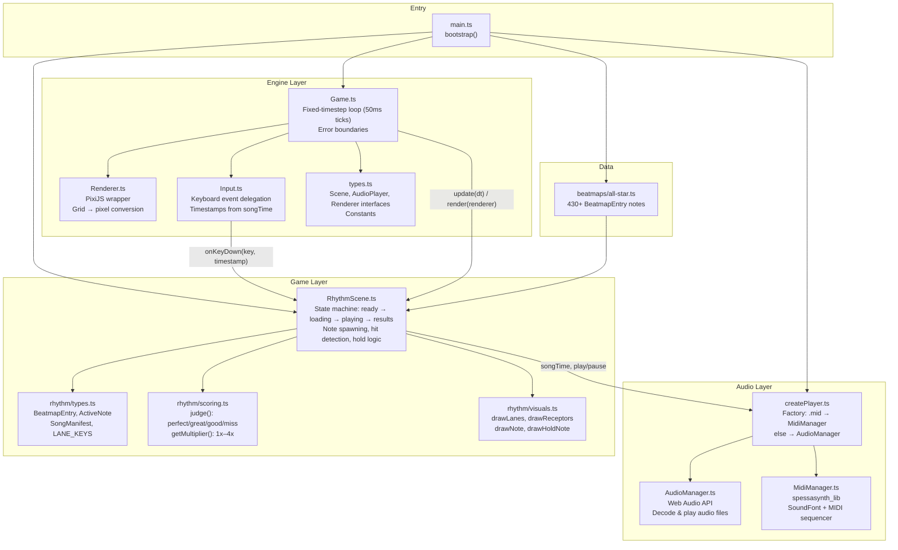
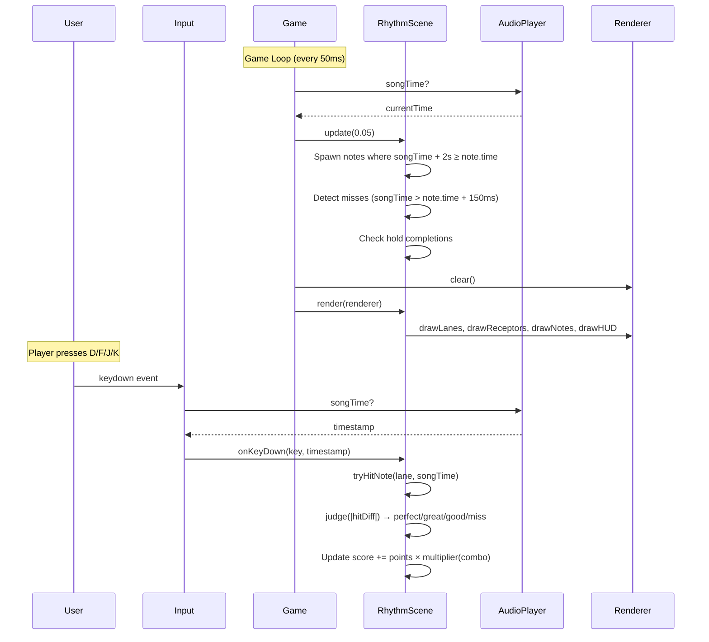
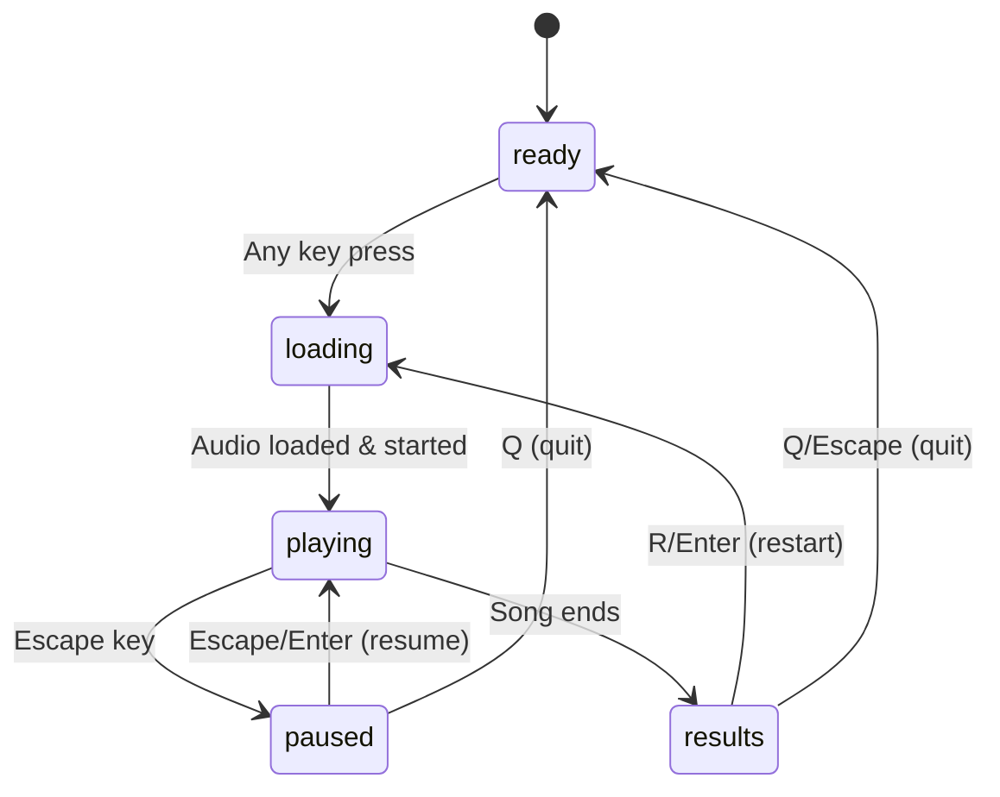

# Music Game Architecture Diagrams

## 1. System Architecture

```mermaid
graph TD
    subgraph Entry
        main["main.ts<br/>bootstrap()"]
    end

    subgraph Engine Layer
        Game["Game.ts<br/>Fixed-timestep loop (50ms ticks)<br/>Error boundaries"]
        Renderer["Renderer.ts<br/>PixiJS wrapper<br/>Grid → pixel conversion"]
        Input["Input.ts<br/>Keyboard event delegation<br/>Timestamps from songTime"]
        Types["types.ts<br/>Scene, AudioPlayer, Renderer interfaces<br/>Constants"]
    end

    subgraph Audio Layer
        createPlayer["createPlayer.ts<br/>Factory: .mid → MidiManager<br/>else → AudioManager"]
        AudioManager["AudioManager.ts<br/>Web Audio API<br/>Decode & play audio files"]
        MidiManager["MidiManager.ts<br/>spessasynth_lib<br/>SoundFont + MIDI sequencer"]
    end

    subgraph Game Layer
        RhythmScene["RhythmScene.ts<br/>State machine: ready → loading → playing → results<br/>Note spawning, hit detection, hold logic"]
        RTypes["rhythm/types.ts<br/>BeatmapEntry, ActiveNote<br/>SongManifest, LANE_KEYS"]
        Scoring["rhythm/scoring.ts<br/>judge(): perfect/great/good/miss<br/>getMultiplier(): 1x–4x"]
        Visuals["rhythm/visuals.ts<br/>drawLanes, drawReceptors<br/>drawNote, drawHoldNote"]
    end

    subgraph Data
        Beatmap["beatmaps/all-star.ts<br/>430+ BeatmapEntry notes"]
    end

    main --> Game
    main --> createPlayer
    main --> RhythmScene
    main --> Beatmap

    Game --> Renderer
    Game --> Input
    Game --> Types

    createPlayer --> AudioManager
    createPlayer --> MidiManager

    Input -->|"onKeyDown(key, timestamp)"| RhythmScene
    Game -->|"update(dt) / render(renderer)"| RhythmScene

    RhythmScene --> RTypes
    RhythmScene --> Scoring
    RhythmScene --> Visuals
    RhythmScene -->|"songTime, play/pause"| createPlayer

    Beatmap --> RhythmScene
```

## 2. Game Loop & Input Sequence

```mermaid
sequenceDiagram
    participant User
    participant Input
    participant Game
    participant RhythmScene
    participant AudioPlayer
    participant Renderer

    Note over Game: Game Loop (every 50ms)
    Game->>AudioPlayer: songTime?
    AudioPlayer-->>Game: currentTime
    Game->>RhythmScene: update(0.05)
    RhythmScene->>RhythmScene: Spawn notes where songTime + 2s ≥ note.time
    RhythmScene->>RhythmScene: Detect misses (songTime > note.time + 150ms)
    RhythmScene->>RhythmScene: Check hold completions
    Game->>Renderer: clear()
    Game->>RhythmScene: render(renderer)
    RhythmScene->>Renderer: drawLanes, drawReceptors, drawNotes, drawHUD

    Note over User: Player presses D/F/J/K
    User->>Input: keydown event
    Input->>AudioPlayer: songTime?
    AudioPlayer-->>Input: timestamp
    Input->>RhythmScene: onKeyDown(key, timestamp)
    RhythmScene->>RhythmScene: tryHitNote(lane, songTime)
    RhythmScene->>RhythmScene: judge(|hitDiff|) → perfect/great/good/miss
    RhythmScene->>RhythmScene: Update score += points × multiplier(combo)
```

## 3. Game State Machine

```mermaid
stateDiagram-v2
    [*] --> ready
    ready --> loading: Any key press
    loading --> playing: Audio loaded & started
    playing --> paused: Escape key
    playing --> results: Song ends
    paused --> playing: Escape/Enter (resume)
    paused --> ready: Q (quit)
    results --> loading: R/Enter (restart)
    results --> ready: Q/Escape (quit)
```
