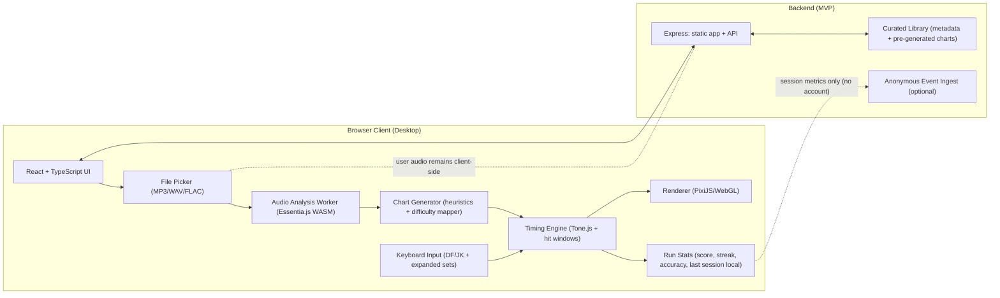

# Product Requirements Document: Rhythm Typing Game

**Working title:** TBD: Music Bopper
**Date:** 2026-02-17
**Authors:** Conor McManamon
**Status:** Draft — living document

---

## 1. Product Objective

Build a browser-based rhythm game where music is converted into a stream of falling notes that the player must type in time. The goal is to allow users to drop in a song and be able to play it.

## 2. Scope

**In scope:**

- A single-player, browser-based rhythm game
- An audio analysis pipeline that converts any uploaded song into a playable note chart
- A curated starter library of songs with polished, pre-generated charts
- User song uploads with auto-generated charts
- Difficulty scaling
- Scoring, streaks, and session stats
- A jazz-inspired visual and audio identity

**Not in scope (for now):**

- Multiplayer / ensemble mode
- Streaming songs via Spotify or YouTube
- Mobile (touch targets and keyboard requirements make this a desktop-browser experience first)
- A chart editor for community-created note maps
- User accounts, leaderboards, or persistent profiles
- Monetization

## 3. Assumptions

- Players use keyboard (not touchscreen)
- Players are on a modern desktop browser (Chrome, Firefox, Safari — latest 2 versions)
- Audio latency in the browser (via Web Audio API) is manageable for a casual-difficulty rhythm game, though it will require calibration
- Small team (2–4 people) can ship an MVP in a focused sprint, then iterate
- Users are willing to upload audio files (MP3, WAV, FLAC) rather than stream from Spotify/Apple Music (streaming API licensing is out of scope)

## 4. Constraints

- Built in web browser.
- Audio latency needs to be managed. ML-based transcription will be hard for clientside to do.
- Song analysis needs backend. Curated library must use royalty-free, Creative Commons, or original recordings.
- User-uploaded songs stay client-side (never stored on our servers) to avoid DMCA exposure.
- No filesystem access (user uploads via file picker), no low-level audio device control, WebGL for rendering.

## System Design

│ Layer │ Tool │ Purpose │
├───────────┼────────────────────┼──────────────────────────────────────────────────────────┤
│ Analysis │ Essentia.js (WASM) │ Beat tracking, onset detection, pitch — runs client-side │
├───────────┼────────────────────┼──────────────────────────────────────────────────────────┤
│ Playback │ Tone.js │ Precise audio scheduling and sync │
├───────────┼────────────────────┼──────────────────────────────────────────────────────────┤
│ Rendering │ PixiJS │ Note stream, visual effects │
├───────────┼────────────────────┼──────────────────────────────────────────────────────────┤
│ Frontend │ React + TypeScript │ UI, state, upload flow │
├───────────┼────────────────────┼──────────────────────────────────────────────────────────┤
│ Backend │ Express │ Serve the app, eventually proxy to ML service │

## 5. Target Audience & User Stories

**Primary audience:** Casual gamers — people who enjoy rhythm games but aren't grinding for perfect scores. Wordle crowd.

**Secondary audience:** Tech demo, so being able to demonstrate live ML transcription, new song uploaded and then turned into multiplayer as a technical feat itself.

### User Stories

- **As a new player,** I want to pick a song from the starter library and be playing within 5 seconds, so I can see if I like the game before uploading my own music.
- **As a player,** I want to upload my favorite song and get a playable note chart generated automatically, so I can play along to music I already love.
- **As a casual player,** I want difficulty levels that feel fun at Easy without feeling trivial, so I can enjoy myself without frustration.
- **As a returning player,** I want to see my score and streak from the last session, so I have a reason to come back and beat it.
- **As a player,** I want the notes I'm typing to feel connected to what I'm hearing — like I'm actually playing the music — so the experience is immersive.
- **As a player with audio latency issues,** I want a simple calibration tool so the game feels fair on my setup.

### User Simple Journey (First Session)

1. Player lands on the game, sees instructions.
2. Selects song, song begins.
3. Play with keyboard keys DF JK.
4. Player continues in song, scoring points. Or fails out.
5. Can restart or select new song.

### User Advanced Journey (First Session)

1. Player lands on the game. A short, animated intro sets the mood — think a neon sign flickering on outside a jazz club.
2. Player sees a curated list of 5 starter songs. Each shows title, artist, duration, and difficulty.
3. Player picks a song. A brief 4-beat count-in plays. Notes begin falling.
4. Player types along. Visual feedback (glow, ripple, color shift) on hits. The music stays full volume regardless of accuracy — do we punish with silence?
5. Song ends. Player sees score, longest streak, accuracy %. A single call-to-action: "Try another" or "Upload your own."
6. Player uploads an MP3. A short loading screen (5–15 seconds) while the analysis pipeline runs. Then they're playing.

## 6. Product Functionality — Game Mechanics

### The Note Stream

Notes fall from the top of the screen toward a "hit zone" at the bottom. Each note is a keyboard character (a letter, number, or symbol). The player presses the corresponding key when the note crosses the hit zone.

**Key mapping philosophy:** Notes should feel musical, not random. The mapping system should:

- Use clusters of adjacent keys for runs (e.g., `a-s-d-f` for a descending line)
- Mirror melodic contour — higher-pitched notes map to keys on the right, lower on the left
- At Easy difficulty, stay on home row. At Hard, use the full keyboard.

### Difficulty Tiers

Note: Develop this out to a "fun" amount of keys. How many is that?

| **Chill** | Home row only (a–l) | Quarter notes, simple rhythms | Generous (±150ms) |
| **Groove** | Home + top row | Eighth notes, light syncopation | Moderate (±100ms) |
| **Virtuoso** | Full keyboard | Sixteenth notes, complex rhythms, chords (simultaneous keys) | Tight (±50ms)

### Scoring

- **Hit quality:** Perfect / Good / OK / Miss, based on timing offset from the ideal beat
- **Streak multiplier:** Consecutive hits without a miss multiply the score (caps at 8x)
- **Groove meter:** A feel-good visual indicator that fills as you maintain a streak. Not punitive — it drains slowly on misses, not instantly. The vibe is encouragement, not punishment.
- **End-of-song summary:** Total score, accuracy %, longest streak, hit quality distribution

### The "Swing" Mechanic (Possible Feature)

This may be impossible to time properly: In jazz, rhythmic feel matters more than robotic precision. Our scoring should reflect this. Instead of only rewarding dead-center timing, the game detects the song's _swing feel_ and adjusts the scoring grid to match. A song with heavy swing rewards slightly laid-back timing. A straight-eighth funk track rewards metronomic hits.

This is subtle, but it makes the game _feel_ different from every other rhythm game. You're rewarded for musicality, not just reaction time.

### Call and Response (Possible Feature)

Certain sections of a song trigger "call and response" mode: the game plays a short phrase (3–6 notes), then the player echoes it back from memory. This mirrors real jazz improvisation and adds a memory/ear-training dimension that pure reaction-time games don't have.

### Visual Feedback

- Notes glow and pulse on successful hits
- The background environment responds to play quality — lights brighten, crowd ambience swells, the scene comes alive when you're in a groove
- Misses don't punish harshly — a subtle flicker, not a jarring buzzer

## 7. Vision — Look and Feel

Jazz album covers, blues and blacks, lighting flickering.

## 8. Core Technical Challenges & Approaches

The central unsolved question: **How do you take an arbitrary audio file and turn it into a fun, playable note chart?**

### Approach A: Beat & Onset Detection (MVP Path)

Use **Essentia** (JS Library) to detect:

- Tempo (BPM) and beat positions
- Note onsets (moments where a new sound begins)
- Spectral features (brightness, energy) to inform difficulty mapping

And control playback use Tone.js for extreme control over note sounds.

Then algorithmically place keyboard notes at detected onset positions, using heuristics to choose which keys map to which events. This is fast, lightweight, and well-understood — but it doesn't capture _melody_, only rhythm.

**Best for:** Getting an MVP running quickly. Works great for percussion-heavy and rhythmically clear music. Less musical for complex harmonies.

### Approach B: ML-Powered Music Transcription

Use **Spotify's Basic Pitch** (open-source neural network) to transcribe audio into MIDI — extracting actual pitches, note durations, and polyphony. MIDI data maps directly to keyboard layout (pitch → key position). This gives melodically accurate charts that feel connected to what the player is hearing.

**Best for:** Making the typing feel like you're _playing the melody_. Requires a backend (the model is ~50MB and needs Python/PyTorch), adding 5–15 seconds of processing per song.

### Approach C: Source Separation + Layered Analysis (Target Architecture)

Use **Meta's Demucs** (or **HTDemucs**) to separate a song into stems — vocals, drums, bass, other instruments. Then apply different analysis to each stem:

- Drums → onset detection → rhythmic backbone of the chart
- Bass → pitch tracking → left-hand / lower-key patterns
- Melody/other → Basic Pitch transcription → right-hand / upper-key patterns
- Vocals → optionally display lyrics as typing targets during vocal sections

This produces the richest, most musical charts. Each difficulty tier can emphasize different stems (Chill = just drums, Groove = drums + bass, Virtuoso = full ensemble).

**Best for:** The full vision. Most compute-intensive. Demucs is heavy (~300MB model, benefits from GPU). Could run as a serverless GPU function (Replicate, Modal, or a lightweight FastAPI backend on a GPU instance).

### Recommended Rendering Stack

**PixiJS** — a 2D WebGL renderer. It's the standard for performant browser-based games with lots of moving sprites. It batches draw calls, handles thousands of animated elements at 60fps, and gives full creative control over the visual language. It's lighter than a full game framework (Phaser, Godot-web) while still being production-grade.

For the atmospheric effects (bokeh, grain, glow), PixiJS's filter system and custom shaders handle this natively.

**Alternative considered:** Phaser 3 (built on PixiJS, adds scene management and input handling). Worth evaluating if the game's state management grows complex, but PixiJS alone is likely sufficient for a single-screen rhythm game.

## 9. Distinguishing Ideas — What Makes This Different

1. **Swing-aware scoring** (described in Section 6). No other typing or rhythm game does this. It rewards musical feel over mechanical precision, which directly serves our casual audience.

2. **Any-song playability.** The upload-and-play pipeline is the killer feature. Curated libraries get stale. Letting players bring their own music makes the game infinitely replayable.

3. **Jazz club atmosphere as gameplay feedback.** The environment isn't decoration — it's a feedback mechanism. Play well and the club comes alive: lights warm, crowd murmurs swell to cheers, a silhouetted bartender nods along. Fall off the groove and the room gets quiet, the lights dim. This is softer than Guitar Hero's "boo" crowd, and more emotionally resonant.

4. **Call and response mode** (described in Section 6). Adds a memory and listening dimension that pure reaction-time games lack. Directly references jazz tradition.

5. **Stem-aware difficulty.** Instead of just thinning out notes for easier difficulties, each tier plays a different _role in the band_. Easy mode plays the drums. Medium adds the bass line. Hard plays the full arrangement. You're not playing a dumbed-down version — you're playing a different instrument.

## 10. Success Metrics

1. Quick to start a song <10 secs after landing on page
2. Session length (how long does a user play)
3. Do users upload their own songs...?
4. Do they rate the auto-generated songs as fun?

## 11. Milestones

### Phase 1: Proof of Concept (Week 1–2)

- [ ] Static note stream falling on screen (PixiJS)
- [ ] Keyboard input detection with timing evaluation
- [ ] Hardcoded note chart for one song — prove the core loop feels good
- [ ] Basic scoring (hit/miss/streak)
- [ ] Audio playback synced to note stream

**Exit criteria:** One song is playable end-to-end and it feels fun.

### Phase 2: Audio Pipeline (Week 3–4)

- [ ] Beat/onset detection pipeline (librosa) generating note charts from audio files
- [ ] File upload UI and processing flow
- [ ] Difficulty tier generation (Chill / Groove from same analysis)
- [ ] Latency calibration tool

**Exit criteria:** Upload an MP3, get a playable chart, play it. The chart feels connected to the music.

### Phase 3: Polish & Identity (Week 5–6)

- [ ] Jazz club visual design — background, lighting, note styling
- [ ] Audio design — ambient sounds, hit/miss feedback, transitions
- [ ] Curated song library (5–10 songs with tuned charts)
- [ ] Score summary screen
- [ ] Swing-aware scoring prototype

**Exit criteria:** The game looks and sounds like a finished product. Someone who didn't build it says "this is cool."

### Phase 4: Advanced Pipeline (Stretch)

- [ ] Source separation via Demucs
- [ ] Multiplayer songs simultaneously occuring
- [ ] Stem-aware difficulty (Virtuoso tier)
- [ ] Call and response mode
- [ ] Basic Pitch integration for melodic charts

**Exit criteria:** The chart quality on uploaded songs is noticeably more musical than Phase 2.

## 12. Tradeoffs & Open Questions

**Pre-built charts vs. auto-generation quality.** Auto-generated charts will never match hand-authored ones for quality. Mitigation: ship a curated library for first impressions, use auto-gen for user uploads where "good enough" is the bar.

**Server-side audio processing vs. client-side.** ML models (Basic Pitch, Demucs) need a backend. This adds infrastructure, cost, and latency. The fallback (librosa-style onset detection) can run server-side cheaply or potentially client-side via WASM. We should start with the simpler pipeline and upgrade.

**Typing as a mechanic — is it fun enough?** Guitar Hero works partly because the physical act of strumming feels like playing guitar. Typing might feel disconnected. The swing scoring and melodic key mapping are our answers to this, but it's an open design risk that needs playtesting early.

**Music licensing for curated library.** We need royalty-free or CC-licensed jazz recordings. Alternatively, we commission short original tracks. This has a cost. Open question: is there a corpus of high-quality Creative Commons jazz?

**Latency calibration UX.** Rhythm games live and die on sync. Most serious rhythm games (osu!, StepMania) require manual offset calibration. Can we make this invisible to casual players? Auto-detection via a "tap along to this beat" onboarding step is the leading idea.

---

_This document is a living artifact. Update it as decisions are made and assumptions are tested._
